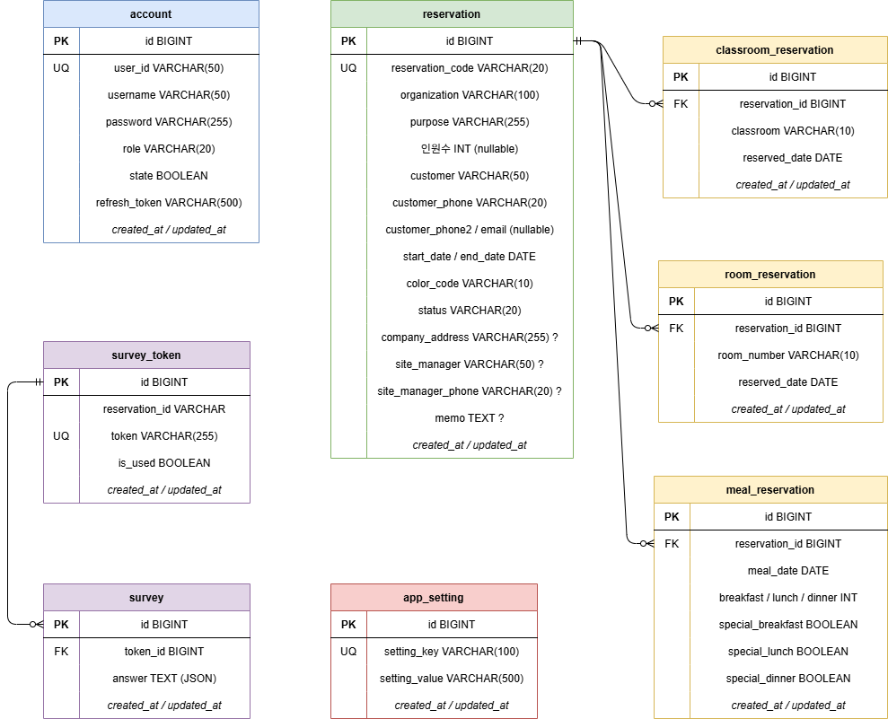

# 🏨 흥국생명 연수원 관리 시스템 v2.0

> 전화로 접수된 예약을 입력·관리하는 **연수원 내부 관리 시스템**

---

## 📋 프로젝트 개요

| 항목       | 내용                        |
| ---------- | --------------------------- |
| 프로젝트명 | 흥국생명 연수원 관리 시스템 |
| 버전       | 2.5.9 Release               |
| 사용 대상  | 연수원 직원                 |

---

## 🛠️ 기술 스택

### 백엔드

| 항목      | 기술               |
| --------- | ------------------ |
| Framework | Spring Boot 3.5.11 |
| Language  | Java 21            |
| ORM       | JPA / Hibernate    |
| DB        | MySQL              |
| 인증      | JWT                |
| 빌드      | Gradle             |

### 프론트엔드

| 항목      | 기술                    |
| --------- | ----------------------- |
| Framework | Next.js 15 (App Router) |
| Language  | TypeScript              |
| 스타일    | CSS Module              |
| 상태관리  | Zustand                 |
| HTTP      | Axios                   |

### 인프라

| 항목     | 기술                        |
| -------- | --------------------------- |
| 서버     | Oracle Cloud ARM (12GB RAM) |
| 컨테이너 | Docker / docker-compose     |
| 개발환경 | Code Server                 |

---

## 👥 사용자 역할 (Role)

| 역할         | 설명      | 권한                            |
| ------------ | --------- | ------------------------------- |
| `ROLE_ADMIN` | 관리자    | 모든 기능 + 계정 관리           |
| `ROLE_USER`  | 일반 직원 | 예약 조회·수정 (계정 관리 불가) |

---

## 🗄️ ERD

## 

## 🌐 API 명세

> 모든 응답 형식: `{ "success": true, "message": "...", "data": { ... } }`

### 인증 (공개)

| Method | Endpoint        | 설명                |
| ------ | --------------- | ------------------- |
| POST   | `/auth/login`   | 로그인 (JWT 발급)   |
| POST   | `/auth/reissue` | Access Token 재발급 |

### 계정 관리 `🔐 JWT 필요`

| Method | Endpoint                        | Auth         | 설명                 |
| ------ | ------------------------------- | ------------ | -------------------- |
| POST   | `/admin/accounts`               | ROLE_ADMIN   | 계정 생성            |
| GET    | `/admin/accounts`               | 인증 필요    | 전체 계정 조회       |
| PATCH  | `/admin/accounts/{id}/role`     | ROLE_ADMIN   | 역할 변경            |
| PATCH  | `/admin/accounts/{id}/password` | ROLE_ADMIN   | 관리자 비밀번호 변경 |
| PATCH  | `/admin/accounts/me/password`   | 인증 필요    | 내 비밀번호 변경     |
| DELETE | `/admin/accounts/{id}`          | ROLE_ADMIN   | 계정 삭제            |

### 예약 관리 `🔐 JWT 필요`

| Method | Endpoint                              | 설명                                                  |
| ------ | ------------------------------------- | ----------------------------------------------------- |
| POST   | `/admin/reservations`                 | 예약 등록 (강의실·객실·식사 포함)                     |
| GET    | `/admin/reservations?year=`           | 연도별 전체 예약 조회                                 |
| GET    | `/admin/reservations/range`           | 날짜 범위 예약 조회 (`?from=&to=`)                    |
| GET    | `/admin/reservations/search`          | 예약 검색 (키워드·상태·날짜 범위·페이징)              |
| GET    | `/admin/reservations/{id}`            | 예약 상세 조회                                        |
| PUT    | `/admin/reservations/{id}`            | 예약 전체 수정 (하위 데이터 재생성)                   |
| DELETE | `/admin/reservations/{id}`            | 예약 취소 (상태를 "취소"로 변경, Soft)                |
| DELETE | `/admin/reservations/{id}/hard`       | 예약 영구 삭제 (하위 데이터 포함)                     |
| GET    | `/admin/reservations/check-classroom` | 강의실 이용 가능 여부 확인 (`?classroom=&date=`)      |

### Excel `🔐 ROLE_ADMIN 필요`

| Method | Endpoint                            | 설명                        |
| ------ | ----------------------------------- | --------------------------- |
| GET    | `/admin/reservations/{id}/estimate` | 견적서 Excel 다운로드       |
| GET    | `/admin/reservations/{id}/trade`    | 거래명세서 Excel 다운로드   |
| GET    | `/admin/reservations/{id}/confirmation` | 확인서 Excel 다운로드   |
| GET    | `/admin/reservations/export`        | 전체 예약 데이터 내보내기   |
| POST   | `/admin/reservations/import`        | 예약 데이터 Excel 가져오기  |

### 설문 (공개 / 관리자 혼합)

| Method | Endpoint                               | Auth | 설명                  |
| ------ | -------------------------------------- | ---- | --------------------- |
| POST   | `/admin/surveys/token/{reservationId}` | 🔐   | 설문 토큰(URL) 생성   |
| GET    | `/admin/surveys/token/{reservationId}` | 🔐   | 예약별 설문 토큰 조회 |
| GET    | `/admin/surveys/tokens`                | 🔐   | 전체 토큰 목록 조회   |
| GET    | `/admin/surveys/{reservationId}`       | 🔐   | 예약별 설문 응답 조회 |
| GET    | `/admin/surveys`                       | 🔐   | 전체 설문 응답 조회   |
| GET    | `/survey/check/{token}`                | 공개 | 토큰 유효성 확인      |
| POST   | `/survey/{token}`                      | 공개 | 설문 응답 제출        |

### 앱 설정 `🔐 JWT 필요`

| Method | Endpoint          | 설명                    |
| ------ | ----------------- | ----------------------- |
| GET    | `/admin/settings` | 설정 전체 조회 (KV Map) |
| PUT    | `/admin/settings` | 설정 전체 저장          |

---

## 📌 기능 명세

### 1. 인증 / 계정 관리

| 기능          | 설명                    | 상태    |
| ------------- | ----------------------- | ------- |
| 로그인        | ID/PW 입력 후 JWT 발급  | ✅ 완료 |
| 로그아웃      | 클라이언트 토큰 제거    | ✅ 완료 |
| 계정 생성     | 관리자가 직원 계정 생성 | ✅ 완료 |
| 역할 변경     | ADMIN ↔ USER 전환       | ✅ 완료 |
| 비밀번호 변경 | 관리자 또는 본인        | ✅ 완료 |
| 계정 삭제     | 관리자만 가능           | ✅ 완료 |

### 2. 예약 관리

| 기능                 | 설명                                     | 상태    |
| -------------------- | ---------------------------------------- | ------- |
| 예약 등록            | 기본정보 + 강의실·객실·식사 한 번에 등록 | ✅ 완료 |
| 예약 조회            | 목록 / 상세 조회                         | ✅ 완료 |
| 예약 수정            | 전체 수정 (하위 데이터 재생성)           | ✅ 완료 |
| 예약 취소            | 상태를 "취소"로 변경 (Soft Delete)       | ✅ 완료 |
| 특식 구분            | 조식·중식·석식별 특식 여부 토글          | ✅ 완료 |
| 업체 주소·현장담당자 | 선택 입력 필드                           | ✅ 완료 |
| 예약 색상            | 20가지 색상 중 선택 (캘린더 표시용)      | ✅ 완료 |
| 강의실 중복 확인     | 날짜·강의실 중복 여부 실시간 체크        | ✅ 완료 |

### 3. 일정 현황 (Scheduler)

| 기능             | 설명                                    | 상태    |
| ---------------- | --------------------------------------- | ------- |
| 월별 현황표      | 강의실·숙소를 행, 날짜를 열로 표시      | ✅ 완료 |
| 식수 현황표      | 날짜별 조식·중식·석식 인원 표시         | ✅ 완료 |
| 호버 팝업        | 예약 간단 정보 미니 팝업                | ✅ 완료 |
| 셀 클릭          | 예약 상세 모달                          | ✅ 완료 |
| 셀 더블클릭      | 날짜·강의실 자동 세팅 후 신규 예약 모달 | ✅ 완료 |
| 특식 시각화      | 주황색 pill 표시                        | ✅ 완료 |
| 상태 시각화      | 확정/예약/문의/취소별 색상 구분         | ✅ 완료 |
| 숙박 배정표      | 날짜 클릭 시 호실별 배정 현황 + 인쇄    | ✅ 완료 |

### 4. 식수 현황 (Restaurant)

| 기능             | 설명                            | 상태    |
| ---------------- | ------------------------------- | ------- |
| 날짜별 식수 현황 | 예약 상태·특식 여부로 색상 구분 | ✅ 완료 |

### 5. 문서 출력

| 기능        | 설명                              | 상태    |
| ----------- | --------------------------------- | ------- |
| 견적서      | 예약 기반 견적서 Excel(.xlsx) 생성 | ✅ 완료 |
| 거래명세서  | 예약 기반 거래명세서 Excel 생성   | ✅ 완료 |

### 6. 설문 시스템

| 기능           | 설명                                     | 상태    |
| -------------- | ---------------------------------------- | ------- |
| 설문 URL 생성  | 예약 기반 고유 토큰 생성                 | ✅ 완료 |
| 설문 응답      | 고객이 링크 접속 후 응답 (로그인 불필요) | ✅ 완료 |
| 설문 결과 조회 | 직원이 응답 결과 확인                    | ✅ 완료 |

### 7. 대시보드

| 기능      | 설명                             | 상태      |
| --------- | -------------------------------- | --------- |
| 통계 차트 | 월별·분기별 예약 건수, 인원 통계 | 🔲 미구현 |

---

_최종 수정: 2026-03-30_
